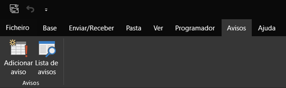
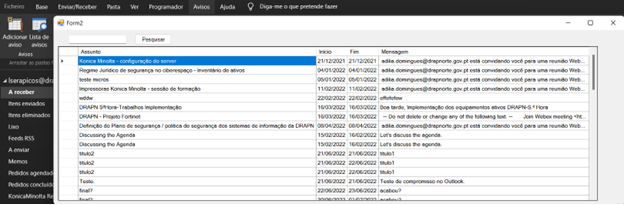
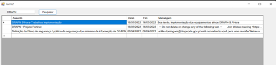
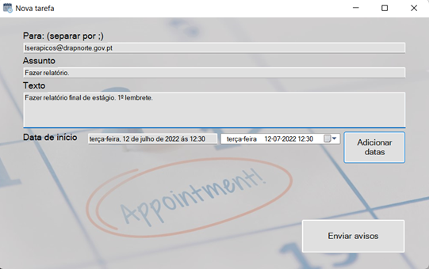
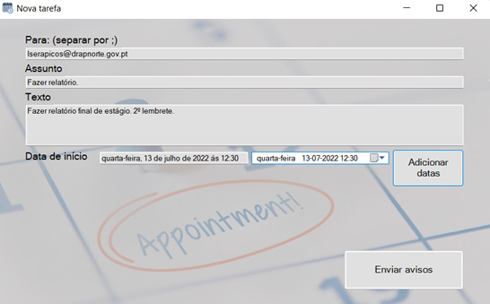
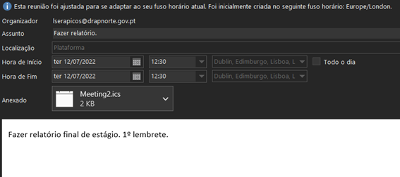
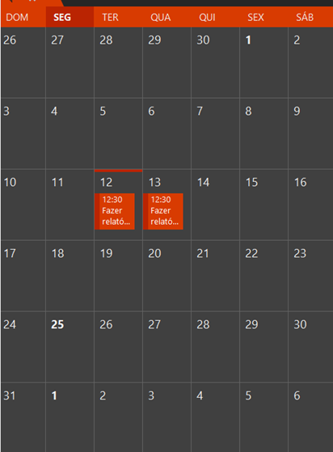
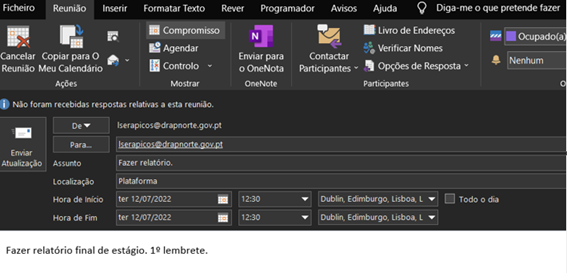
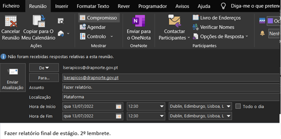

# OutlookAddIn

## Criação de múltiplos avisos no Outlook

Uma das dicas importantes para aumentar a produtividade no trabalho é a organização do tempo, e o Outlook dispõe de uma ferramenta que ajuda, entre outras, a ter uma melhor organização. 
Desta forma, foi então desenvolvido um pequeno add-in para o Outlook que, através de um formulário onde fossem especificados os destinatários (os eventos podem ser partilhados com outros utilizadores), título, descrição e data do evento/compromisso/aviso, fossem criados múltiplos (conforme as múltiplas datas inseridas pelo utilizador) eventos no calendário do Outlook.
O add-in, depois de instalado, pode ser acedido na barra de tarefas do Outlook na aba “Avisos”.

A funcionalidade “Lista de avisos” consiste na apresentação de todos os eventos já inseridos nos calendários do Outlook, e pode ser pesquisável através da caixa de pesquisa.

Em “Adicionar aviso”, após preenchido o formulário, é necessário clicar no botão “Adicionar datas” para guardar o primeiro evento, e de seguida voltar a preencher o formulário e voltar a adicionar datas, e assim sucessivamente até não querermos adicionar mais eventos, e aí podemos clicar no botão “Enviar avisos” para ser enviado um email para os destinatários com a informação dos eventos.

Após o envio dos eventos, é rececionado um email com a informação dos eventos e um anexo (.ics) que contém os eventos criados e o passo seguinte é abrir esse anexo.

Finalmente os eventos estão publicados no calendário.

